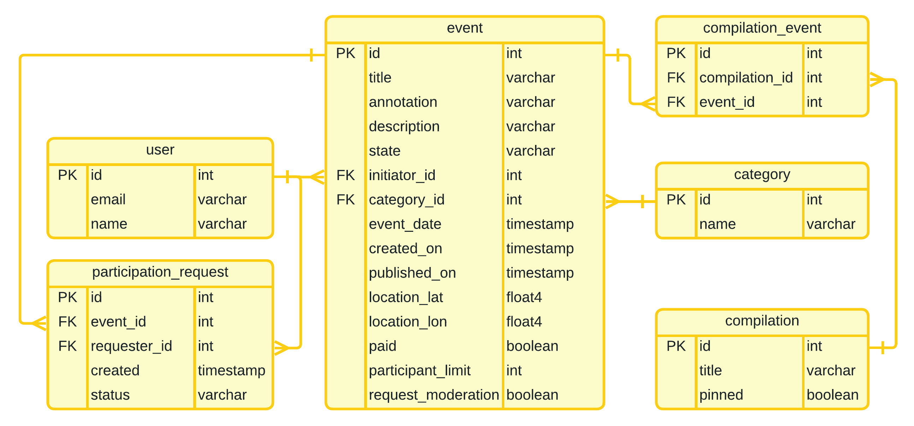
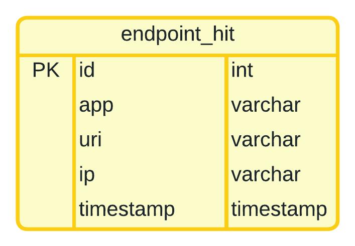

# Explore With Me
This project is an application for sharing information about interesting events and finding a company to participate in them.
The application users can create their own events or make requests to participate in other users' events. All events are categorized, and service administrators are able to create compilations of events.

## ER Diagram
### Main Service DB

### Stats Service DB

## PR request link: 
https://github.com/veronyurova/java-explore-with-me/pull/1

